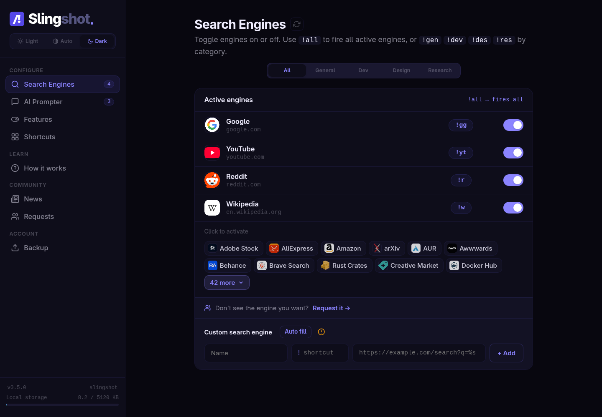
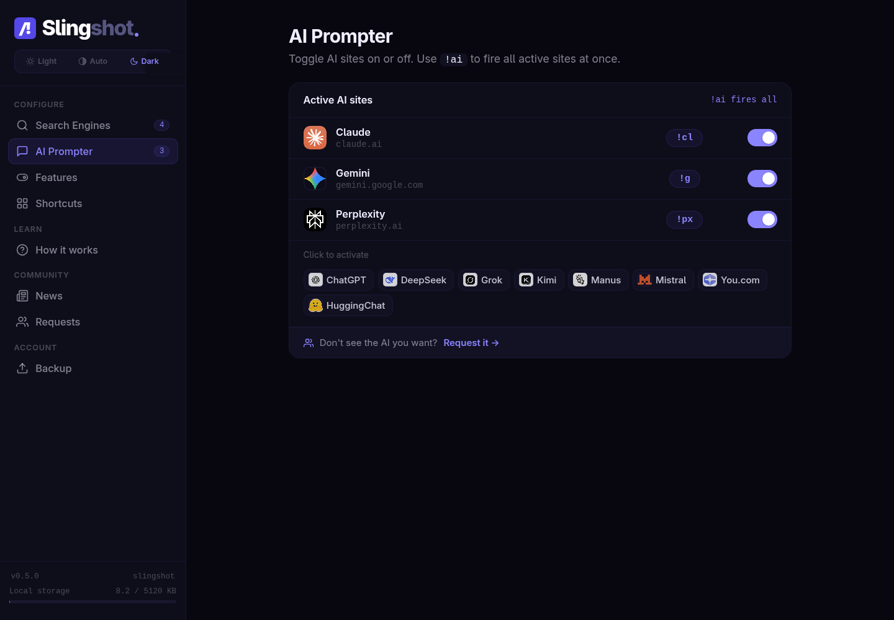
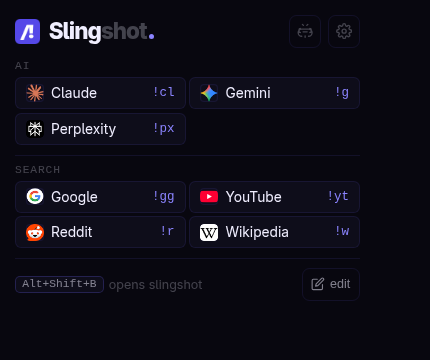

# Slingshot - AI prompt launcher and custom bang search extension

[](https://addons.mozilla.org/en-US/firefox/addon/slingshot/)
[](https://chromewebstore.google.com/detail/slingshot/cgclkhlbabhmibdmedkhbcpflcjpalmg)
[](manifest.json)
[](SOURCE-LICENSE.md)

Slingshot is a browser extension for fast custom bang search, AI prompt launching, and multi-site search shortcuts. Type a shortcut such as `!yt lo-fi beats`, `!cl explain this code`, or `!all laptop stand`, and Slingshot opens the right search engine or AI assistant instantly.

Install the official extension:

- [Slingshot for Chrome, Edge, Brave, and other Chromium browsers](https://chromewebstore.google.com/detail/slingshot/cgclkhlbabhmibdmedkhbcpflcjpalmg)
- [Slingshot for Firefox](https://addons.mozilla.org/en-US/firefox/addon/slingshot/)

## Screenshots







## Features

- Custom search engine shortcuts inspired by DuckDuckGo-style bangs.
- AI prompt launcher for ChatGPT, Claude, Gemini, Perplexity, DeepSeek, Kimi, Manus, and more.
- Omnibox keyword support: type `bg !yt cats` in the address bar.
- Search-page interception for Google, Bing, and DuckDuckGo queries that contain Slingshot shortcuts.
- Meta shortcuts:
  - `!ai` opens all active AI tools.
  - `!all` opens all active search engines.
  - `!gen`, `!dev`, `!des`, and `!res` open active engines by category.
- Import/export for manual backups.
- Theme support, keyboard shortcut settings, community requests, and news updates.

## Examples

```text
!yt synthwave mix        -> YouTube search
!r mechanical keyboard   -> Reddit search
!w Alan Turing           -> Wikipedia search
!cl summarize this       -> Claude prompt
!ai compare these ideas  -> all active AI sites
!dev react suspense      -> active developer search engines
```

The default trigger is `!`, but it can be changed in the settings page.

## Local Development

This repository is a plain Manifest V3 WebExtension. There is no build step for normal development.

1. Clone the repository.
2. Open Chrome or another Chromium browser.
3. Go to `chrome://extensions`.
4. Enable Developer mode.
5. Choose **Load unpacked** and select this repository folder.

For Firefox:

1. Open `about:debugging#/runtime/this-firefox`.
2. Choose **Load Temporary Add-on**.
3. Select `manifest.json`.

## Packaging

Create a browser-store zip from the repository root:

```bash
bash scripts/package-extension.sh
```

The script reads the version from [manifest.json](manifest.json), validates required runtime paths, and writes `slingshot_V<version>.zip`. The package is intentionally limited to extension runtime files and excludes docs, SQL setup files, screenshots, and local artifacts.

## Privacy And Hosted Backend

Official Slingshot builds use a hosted Supabase backend for:

- search engine list updates,
- news and announcements,
- community requests and voting,
- anonymous daily heartbeat telemetry.

Telemetry is aggregate and anonymous. It uses a generated install ID and sends extension version, enabled state, active/custom shortcut counts, active site IDs, and shortcut usage counts. Slingshot does not collect browsing history, page content, search result pages, account credentials, or AI conversation contents.

The Supabase URL and anon key in the client are public by design. Security must be enforced by Supabase Row Level Security policies, RPC validation, and Edge Function validation. See [docs/supabase](docs/supabase) for the hosted backend schema and self-hosting notes.

## Source Visibility And Contributions

This repository is public so users can inspect how Slingshot works, report issues, and propose improvements. It is **not** released under an open-source license. Copying, redistribution, modified releases, commercial reuse, or derivative projects require written permission.

Read [SOURCE-LICENSE.md](SOURCE-LICENSE.md) before reusing any code.

Useful docs:

- [Architecture](docs/ARCHITECTURE.md)
- [SEO and store listing notes](docs/marketing/SEO_AND_STORE_LISTING.md)
- [Supabase setup](docs/supabase)

## Repository Topics

Suggested GitHub topics: `chrome-extension`, `firefox-addon`, `webextension`, `browser-extension`, `manifest-v3`, `custom-search`, `bang-search`, `duckduckgo-bangs`, `ai-tools`, `ai-prompt`, `omnibox`, `productivity`.
